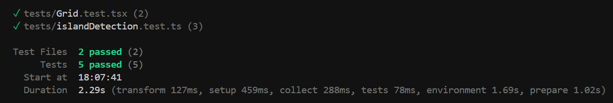

# Sea World Islands

Sea World Islands is a web application that allows users to create and manipulate a small sea world represented by a grid. Users can add or remove land to create tiny islands, change the size of the world, and view statistics about the world.

## Features

- Interactive grid representing the sea world
- Toggle cells between sea (empty) and land (filled) states
- Adjustable grid size
- Real-time statistics:
  - Number of filled cells
  - Number of islands
  - Total number of cells

## Technologies Used

- React
- TypeScript
- Vite
- Tailwind CSS
- Vitest
- React Testing Library

## Project Structure

```
sea-world-islands/
├── public/
├── src/
│ ├── components/
│ │ ├── Cell.tsx
│ │ ├── Controls.tsx
│ │ ├── Grid.tsx
│ │ └── Statistics.tsx
│ │ └── ThemeToggle.tsx
│ ├── utils/
│ │ ├── gridUtils.ts
│ │ └── islandDetection.ts
│ ├── App.tsx
│ ├── index.css
│ └── main.tsx
├── tests/
│ ├── Grid.test.tsx
│ └── islandDetection.test.ts
├── index.html
├── package.json
├── tsconfig.json
├── vite.config.ts
└── README.md
```

## Getting Started

### Prerequisites

- Node.js (v14 or later)
- npm (v6 or later)

### Installation

1. Install dependencies:

```
npm install
```

2. Start the development server:

```
npm run dev
```

3. Open your browser and navigate to `http://localhost:5173`

## Running Tests

To run the test suite, use the following command:

```
npm test
```

## Output



## How It Works

1. The main `App` component manages the state of the grid and its dimensions.
2. The `Controls` component allows users to adjust the grid size.
3. The `Grid` component renders the sea world using individual `Cell` components.
4. The `Statistics` component displays information about the current state of the world.
5. Utility functions in `gridUtils.ts` and `islandDetection.ts` handle grid manipulation and island counting.


## Home Page


## Contributing

Contributions are welcome! Please feel free to submit a Pull Request.

## License

This project is licensed under the MIT License.
